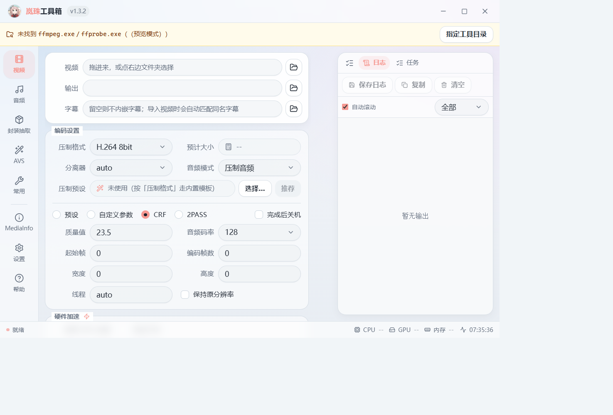
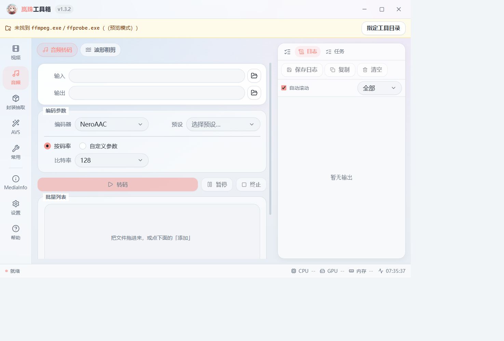
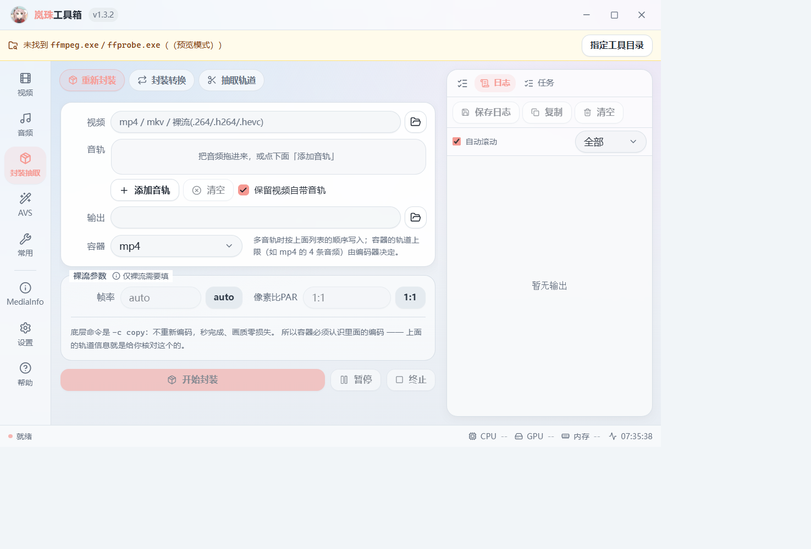
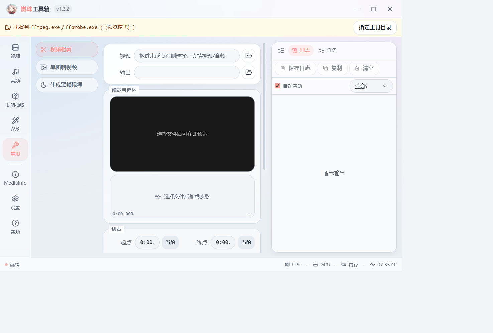
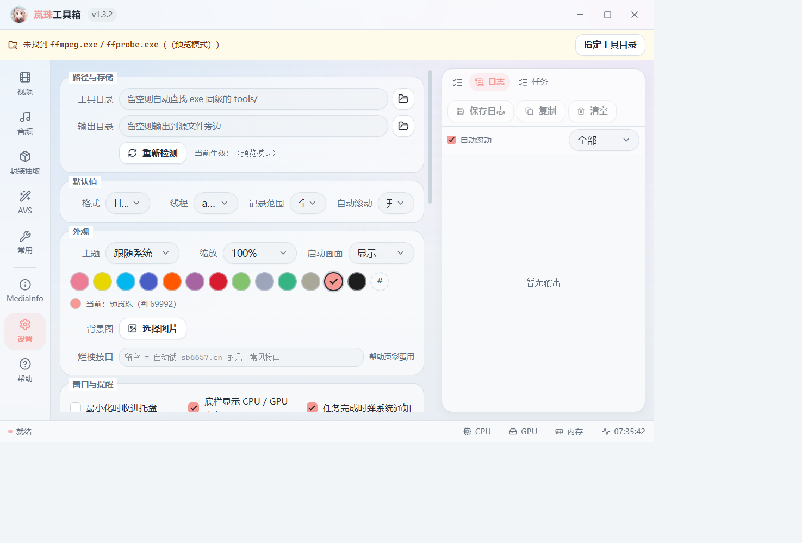
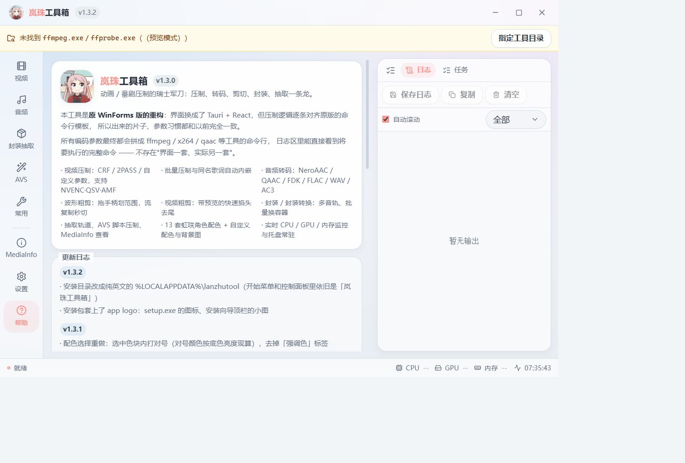

<div align="center">


# 岚珠工具箱 · LanzhuToolNX

动画 / 番剧压制的瑞士军刀 —— 压制、转码、粗剪、封装、抽取一条龙

[](LICENSE)
[](#下载)
[](https://tauri.app)
[](../../releases/latest)

</div>

## 这是什么

**岚珠工具箱**是经典压制工具 [小丸工具箱]（Maruko's Toolbox，
原作者 [小丸](http://www.maruko.in/)，ACICFG 技术支持）的重构版。
界面从 WinForms 换成了 **Tauri 2 + React 19 + Tailwind v4**，
但压制逻辑**逐条对齐原版的命令行模板** —— 出来的片子、参数习惯、文件名规则都和以前一致。

所有参数最终都会拼成 `ffmpeg` / `x264` / `qaac` 等工具的命令行，**日志区能直接看到将要执行的完整命令**，
不存在「界面一套、实际另一套」。Rust 侧还有 19 条单元测试锁死这些命令行模板。

> 为什么叫岚珠：主题色默认取虹咲学园 **钟岚珠** 的应援色 `#F69992`，
> 配色表里另外 12 位角色的应援色也都在。

## 功能

| 页面 | 能做什么 |
| --- | --- |
| **视频** | CRF / 2PASS / 自定义参数三档；NVENC · QSV · AMF 硬件加速与混合压制；自动生成输出文件名、自动匹配同名（含语言后缀）字幕；预计大小随参数实时变化；**压制预设**内置 18 条（ProRes / DNxHR / AV1 / VP9 / FFV1 / MPEG-2 …）并可按源分辨率推荐；批量压缩队列 |
| **音频** | NeroAAC / QAAC / FDK-AAC / FLAC / WAV / AC3 转码；**波形粗剪** —— 拖手柄划范围，流复制秒切 |
| **封装抽取** | 重新封装（多音轨导入、替换或保留源音轨、可选容器）、**封装转换**（批量换容器，必要时音频转 AAC）、抽取视频 / 音频 / 轨道 |
| **AVS** | AviSynth 脚本写压制，脚本可存可载 |
| **常用** | 带预览与波形的**视频粗剪**、单图转视频、生成黑帧视频 |
| **MediaInfo** | 媒体信息查看，带最近打开 10 个文件 |
| **设置** | 工具目录 / 输出目录、下载加速源、工具在线获取与离线包导入、外观（13 套应援色 + 自定义色号 + 背景图 + 界面缩放 + 可跳过启动画面）、压制默认值、日志范围、托盘与通知 |
| **帮助** | 介绍、更新日志，以及一条可以「换一换」的烂梗 |

界面之外还有：实时 CPU / GPU / 内存监控、就绪灯与总体进度、完成通知、完成后关机、
关闭即收进托盘（暂停 / 终止 / 打开输出目录都在托盘菜单里）。

## 界面截图

| 视频压制 | 音频转码 |
| --- | --- |
|  |  |

| 封装 / 抽取 | 常用小工具 |
| --- | --- |
|  |  |

| 设置 | 帮助与更新日志 |
| --- | --- |
|  |  |

## 下载

到 [Releases](../../releases/latest) 下载 `LanzhuToolNX_x.y.z_x64-setup.exe`，双击安装即可
（默认装到 `%LOCALAPPDATA%\lanzhutool`，不需要管理员权限；开始菜单与控制面板里显示为「岚珠工具箱」）。
安装包文件名用 ASCII 是为了下载/命令行场景不出乱码，程序本身与安装目录照旧。

- 系统要求：**Windows 10 / 11 x64** + WebView2 运行时（Win11 与较新的 Win10 已自带）
- ⚠️ 安装包**不含 `tools/`**（FFmpeg 一套就 640MB）。首次运行到
  **设置 → 工具获取**点几下就装好了，或者用离线包导入。

## 工具从哪来

程序按这个顺序找 `ffmpeg.exe` 等可执行文件：

1. 设置里的「工具目录」
2. 程序同级的 `tools/`
3. 上一级的 `tools/`
4. 环境变量 `LANZHUTOOL_TOOLS` → `%APPDATA%\LanzhuTool\tools`
5. 开发期的仓库目录

找到的 exe 会**按文件名递归索引**，所以 `tools/video/ffmpeg/ffmpeg.exe` 这种嵌套结构可以直接用，
压缩包不用解平；程序也不会去污染工作目录。

三条获取途径：

- **在线下载**：设置 → 工具获取。默认走 `ghfast.top` / `gh-proxy.com` 等加速镜像，
  可自行编辑镜像列表，最后会自动回落到直连 GitHub。
- **离线包**：在能上网的机器上导出 zip，另一台机器导入（自动跳过 214MB 的 `ffplay.exe`）。
- **手动摆放**：把 exe 丢进 `tools/` 下任意层级的子目录即可。

## 从源码构建

需要 **Node 18+**、**Rust 1.77+**（MSVC 工具链）。仓库里 `.npmrc` 与
`src-tauri/.cargo/config.toml` 已配好国内镜像。

```bash
cd tauri-ui
npm install
npm run tauri dev     # 开发
npm run tauri build   # 出 NSIS 安装包
```

- Tauri 用系统 WebView2，不打 Chromium，所以整个 exe 只有 6MB 左右。
- `npm run dev` 可以**在纯浏览器里**预览全部 8 个页面调样式（`src/lib/api.ts` 里有 Tauri 环境守卫，
  没有运行时就返回兜底数据）。
- 安装包目录名的实现方式：`tauri-ui/src-tauri/nsis/installer.nsi` 是 vendor 过的 NSIS 模板，
  只加了一个 `INSTALLDIRNAME`，让「安装目录英文、界面中文」同时成立。
  **升级 Tauri CLI 后需要重新同步这份模板。**
- 改过 `src-tauri/src/cmd.rs` 里的命令行模板后，务必重跑 `cargo test`。

<details>
<summary>原 WinForms 版（仍在仓库中，可独立构建）</summary>

`mp4box/`、`ControlExs/` 是原版 WinForms 程序与自绘皮肤库，功能完整保留，用 VS2022 BuildTools 构建。
它依赖 COM 引用（`ResolveComReference`），`dotnet build` 会报 MSB4803，必须走完整 MSBuild 并指向仓库自带的 NetFx SDK 工具目录：

```powershell
& "C:\Program Files (x86)\Microsoft Visual Studio\2022\BuildTools\MSBuild\Current\Bin\MSBuild.exe" .\mp4box.sln `
  /t:Build /p:Configuration=Debug `
  /p:SDK40ToolsPath="$PWD\_sdk\WinSDK-NetFx40Tools-x86\" `
  /p:TargetFrameworkSDKToolsDirectory="$PWD\_sdk\WinSDK-NetFx40Tools-x86\" /v:m /nologo
```

产物为 `mp4box\bin\Debug\lanzhutool.exe`（.NET Framework 4.8 / x86 / C# 7.3）。

</details>

## 项目结构

```
tauri-ui/               新版界面（Tauri 2 + React 19 + Tailwind v4）
  src/                  前端：pages/ 8 个页面、components/、lib/api.ts、globals.css 设计令牌
  src-tauri/src/        后端：cmd.rs 命令行模板、run.rs 执行与输出回传、probe.rs 探测、
                        tools.rs 工具索引、settings.rs 设置、media.rs lzmedia 协议、
                        sysmon.rs 性能读数、tray.rs 托盘、tools_fetch.rs 在线获取、meme.rs 彩蛋
mp4box/                 原 WinForms 版主程序（MainForm.cs ~5500 行）
ControlExs/             仿 QQ 皮肤控件库
tools/                  可执行工具（不入库，见上）
update_tools.ps1        工具批量更新脚本
```

## 致谢与贡献者

- **[小丸](http://www.maruko.in/)** —— [小丸工具箱] 原作者，本项目的起点与命令行模板来源
- **[shengengfun](https://github.com/shengengfun)** —— 重构与维护
- **DeepSeek** —— AI 编程助手，参与了界面重构、命令行模板对齐、测试与文档
- **GitHub Copilot** —— AI 编程助手，参与了早期版本的开发

欢迎提 Issue / PR。提 PR 前请确认 `cd tauri-ui && npx tsc --noEmit` 与
`cargo test`（在 `tauri-ui/src-tauri` 下）都是干净的。

## 许可证

[Apache License 2.0](LICENSE)。原项目 小丸工具箱 采用 Apache-2.0，本项目沿用同一许可证。

[小丸工具箱]: https://marukotoolbox.codeplex.com
